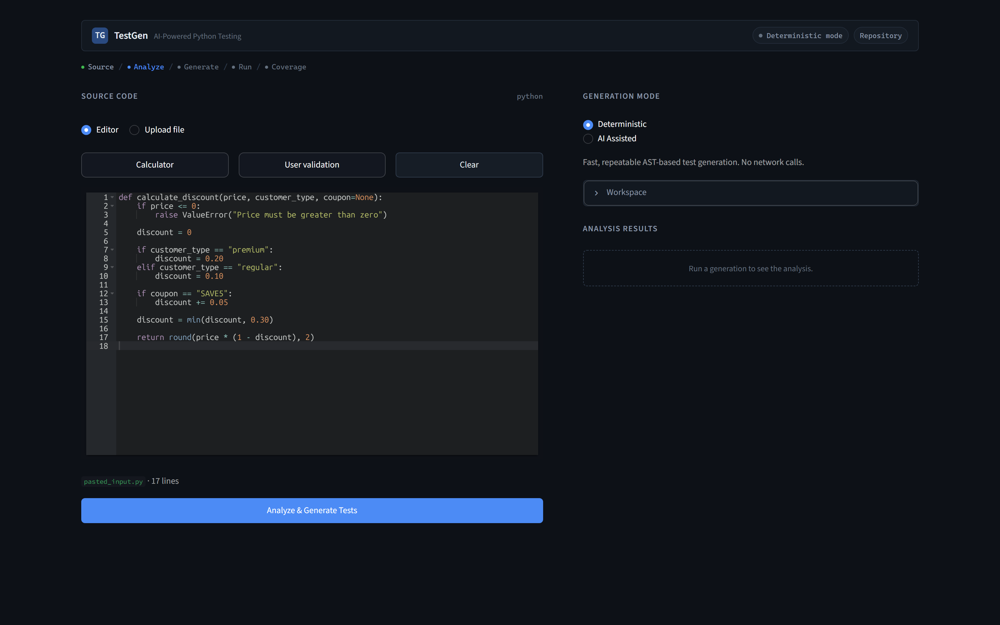
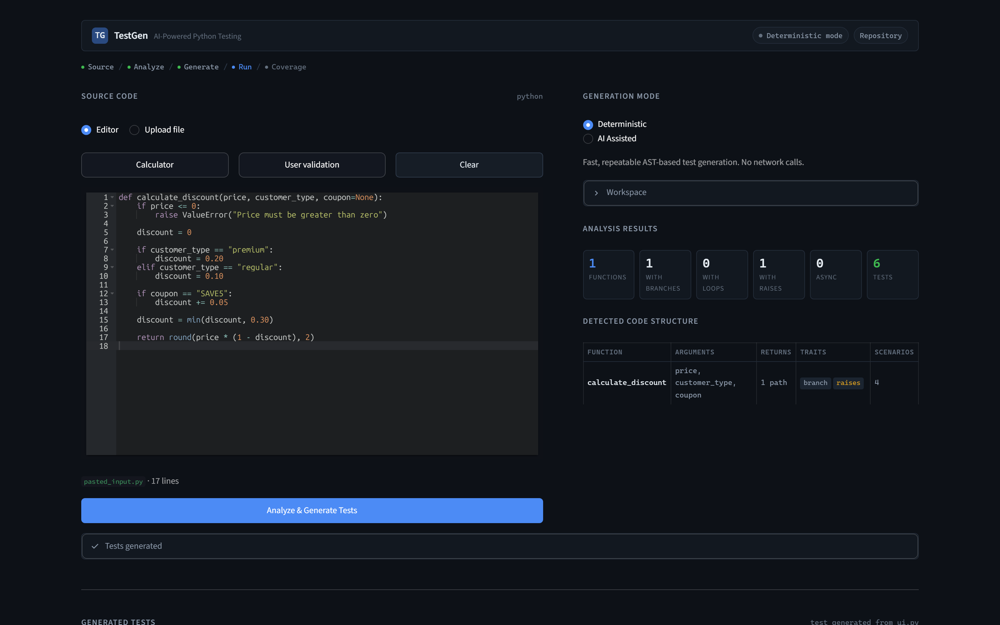
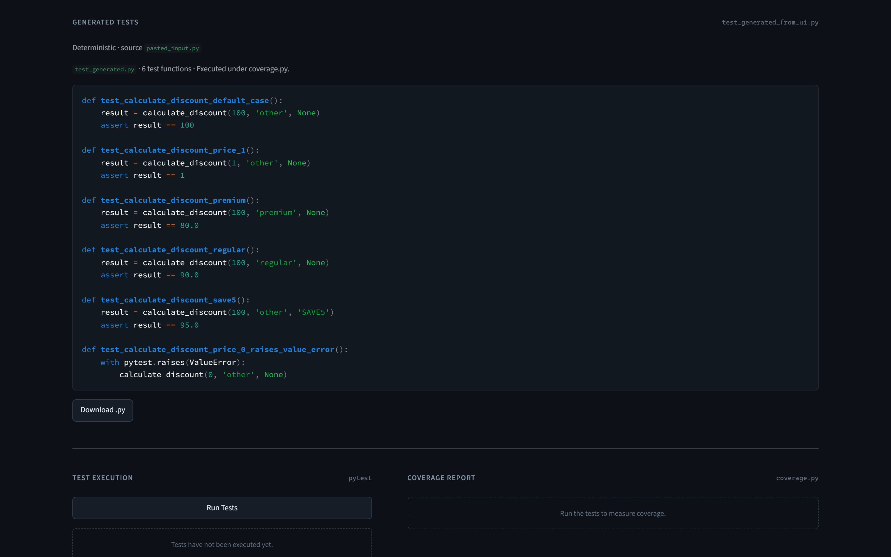
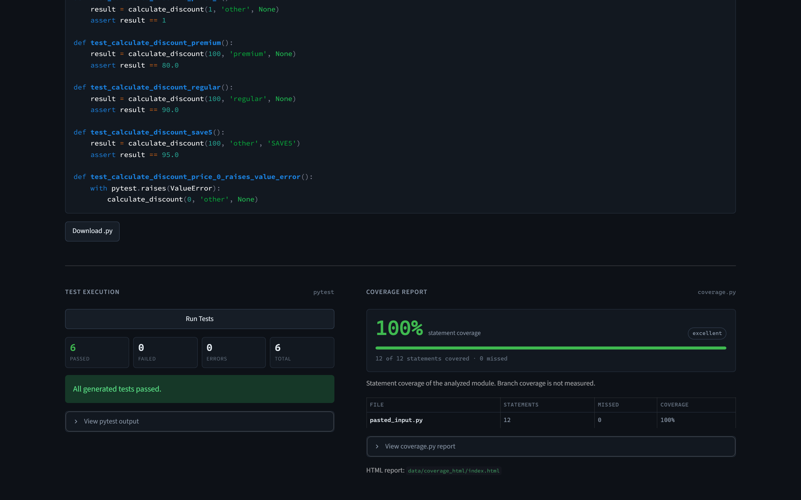
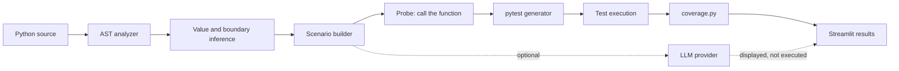

# TestGen

**AST-driven and AI-assisted automated test generation for Python.**

TestGen analyzes Python source code, infers meaningful test scenarios, generates
executable pytest tests, runs them, and measures coverage — through a Streamlit
interface or from the command line.




---

## Why TestGen

Writing tests for existing code is mostly mechanical work: find the branches,
pick inputs that reach them, work out what the function should return, and
remember the error paths. That work is repetitive, and it is usually the reason
coverage stalls.

TestGen automates the mechanical part. It reads a function's own AST to learn
which literals it compares against, which comparisons guard a `raise`, and where
its boundaries are — then builds one scenario per interesting input and derives
the expected value by actually calling the function.

The result is not `assert result is not None`. It is:

```python
def test_calculate_discount_premium():
    result = calculate_discount(100, 'premium', None)
    assert result == 80.0
```

This is deliberately more than handing source code to a language model. The
deterministic path needs no network, no API key, and produces the same output
every run. AI assistance is optional and additive.

---

## Demo

The examples below use the discount-calculation sample bundled with the app.

### 1. Analyze Python source

The AST analyzer reports the functions it found, which of them branch, loop,
raise, or are `async`, along with their arguments and return paths.



### 2. Generate meaningful pytest tests

Each scenario targets a specific branch, is named after what it exercises, and
asserts a concrete expected value. Error paths become `pytest.raises` tests.



### 3. Execute and measure coverage

The generated suite runs under `coverage.py` and the results come straight from
that run.



> In the included discount-calculation demo, TestGen generates six tests that all
> pass and reach 100% statement coverage. Coverage on other code depends entirely
> on the structure of that code and on which scenarios the generator can infer.

---

## Key features

**Static analysis**
- Module-level function discovery with arguments, annotations and defaults
- Branch, loop, printed-output and `async def` detection
- Explicit `raise` detection, including which comparison guards the error path
- Class methods and nested functions are reported and skipped (they cannot be
  imported by name)

**Value inference**
- String and numeric literals extracted from `==` / `!=` comparisons
- Boundary values derived from `<`, `<=`, `>`, `>=` (`price <= 0` yields `0` to
  trip the guard and `1` on the valid side)
- `is None` checks contribute a `None` candidate
- Parameters used as bare truth values contribute `True` / `False`
- Loop and subscript usage infer list and dictionary shapes
- Declared type annotations take priority over inference from the body

**Test generation**
- One scenario per interesting input, varying a single parameter at a time
- A baseline case chosen to miss every branch and guard, exercising the default path
- Expected values derived by calling the function and reproducing the real result
- `pytest.approx` for floats whose decimals are binary-rounding noise
- `pytest.raises` emitted only when the call genuinely raised
- `capsys` assertions on real captured stdout
- `asyncio.run(...)` wrapping for coroutine functions
- Descriptive test names (`test_calculate_discount_premium`)

**Execution and reporting**
- Generated suite executed with pytest, pass/fail/error counts parsed from the run
- Statement coverage and per-file figures from `coverage.py`, plus an HTML report

**Interface**
- Streamlit UI with a code editor, loadable samples, and downloadable test files
- CLI entry point for the same pipeline

---

## Deterministic vs AI-assisted

TestGen always produces a deterministic suite. AI assistance adds a second suite
alongside it; it never replaces it.

| | Deterministic | AI-assisted |
| --- | --- | --- |
| Source of tests | AST analysis and inference rules | Language model, prompted with the plan and function bodies |
| Repeatable | Yes | No |
| Network / API key | Not required | Required (except the `mock` provider) |
| Executed by the app | **Yes** | No — shown and downloadable only |
| Counted in coverage | Yes | No |

**Deterministic** mode runs entirely offline. It reads comparison literals,
derives numeric boundaries, identifies exception paths, and builds scenarios from
that evidence.

**AI-assisted** mode additionally asks a configured provider for tests. The reply
is stripped of Markdown fences, checked for `def test_`, and parsed with
`ast.parse` before it is displayed. Supported providers:

| Provider | Secret name | Notes |
| --- | --- | --- |
| `mock` | none | Local stub, no credentials needed |
| `openai` | `OPENAI_API_KEY` | Custom base URL supported |
| `gemini` | `GEMINI_API_KEY` | |
| `claude` | `ANTHROPIC_API_KEY` | |
| `deepseek` | `DEEPSEEK_API_KEY` | OpenAI-compatible endpoint |

If a provider is unavailable for any reason — missing key, network error, a reply
that is not code, or code that does not parse — the app says so plainly and you
still get the deterministic tests. Because only the deterministic suite is
executed, an unreliable model answer can neither distort the coverage number nor
run in your environment.

---

## How it works



The probe step is what makes the assertions meaningful: each candidate scenario
is executed once during generation, and the emitted assertion states the value
the function actually returned. A scenario is only turned into a `pytest.raises`
test if the call really raised, and only for an exception type the function
raises explicitly.

---

## Project structure

```text
src/
├── analyzer/           # AST parsing: functions, args, branches, raises, async
├── test_generator/     # Inference, scenarios, probing and pytest emission
│   ├── value_inference.py   # Pure AST evidence -> candidate values
│   ├── scenarios.py         # Scenario building, probing, naming
│   └── test_generator.py    # Emits the pytest module
├── llm/                # Optional AI providers and the fallback-safe service
├── cov_tools/          # coverage.py driver and result parsing
├── web/                # Streamlit UI (app, components, styles, state)
└── main.py             # CLI entry point

tests/                  # The project's own test suite
data/sample_code/       # Bundled sample target for the CLI
docs/images/            # Screenshots used in this README
```

---

## Example

Given this input:

```python
def calculate_discount(price, customer_type, coupon=None):
    if price <= 0:
        raise ValueError("Price must be greater than zero")

    discount = 0

    if customer_type == "premium":
        discount = 0.20
    elif customer_type == "regular":
        discount = 0.10

    if coupon == "SAVE5":
        discount += 0.05

    discount = min(discount, 0.30)

    return round(price * (1 - discount), 2)
```

TestGen generates six tests. Four of them, verbatim:

```python
def test_calculate_discount_premium():
    result = calculate_discount(100, 'premium', None)
    assert result == 80.0


def test_calculate_discount_regular():
    result = calculate_discount(100, 'regular', None)
    assert result == 90.0


def test_calculate_discount_save5():
    result = calculate_discount(100, 'other', 'SAVE5')
    assert result == 95.0


def test_calculate_discount_price_0_raises_value_error():
    with pytest.raises(ValueError):
        calculate_discount(0, 'other', None)
```

Note what the generator worked out on its own: `'premium'`, `'regular'` and
`'SAVE5'` came from the equality comparisons in the body; `'other'` is a value
deliberately chosen to match none of them so the baseline exercises the
no-discount path; `0` is the exact boundary that trips `price <= 0`; and
`80.0`, `90.0`, `95.0` are the values the function really returns.

---

## Verified demo

Measured on the discount-calculation demo above during the most recent
development pass:

| Check | Result |
| --- | ---: |
| Generated demo tests | 6 |
| Passed | 6 |
| Failed | 0 |
| Errors | 0 |
| Demo statement coverage | 100% (12 of 12 statements) |
| Project test suite | 170 passed |

Coverage reflects the analyzed source and the scenarios the generator was able to
infer for it. It is not a guarantee for arbitrary code.

---

## Installation

```bash
git clone https://github.com/MuhittinEfeKilic/ai-based-test-generation.git
cd ai-based-test-generation
```

```bash
python -m venv .venv
```

Activate it — on Windows:

```bash
.venv\Scripts\activate
```

On macOS or Linux:

```bash
source .venv/bin/activate
```

```bash
pip install -r requirements.txt
```

Python 3.11 or newer is required (developed and tested on 3.13). The provider
SDKs in `requirements.txt` are optional — deterministic mode and the `mock`
provider need none of them.

### API keys (optional)

Only needed for AI-assisted mode with a real provider:

```bash
cp .streamlit/secrets.toml.example .streamlit/secrets.toml
```

Fill in only the providers you use. `secrets.toml` is git-ignored. A key can also
be entered in the UI at runtime; it is held in the session only and is never
written to disk or logged.

---

## Usage

Start the interface:

```bash
streamlit run src/web/app.py
```

Then:

1. Paste Python code, click a bundled sample, or upload a `.py` file.
2. Choose **Deterministic** or **AI Assisted** generation.
3. Press **Analyze & Generate Tests** to see the analysis and the generated suite.
4. Inspect the generated pytest code.
5. Press **Run Tests** to execute it.
6. Review the coverage report, and download the tests as a `.py` file.

The same pipeline is available without the UI:

```bash
python src/main.py
```

```bash
python src/main.py path/to/your_module.py
```

Generated tests are skipped unless `RUN_UI_GENERATED=1` is set, so a normal
`pytest` run only executes the project's own suite:

```bash
pytest
```

---

## Execution and safety

> **TestGen executes the code it analyzes.** Deterministic generation imports the
> target module and calls its functions in order to derive expected values, and
> the generated suite is then executed with pytest. Do not analyze untrusted code
> with this prototype.

Two things limit the blast radius, and neither is a sandbox:

- Each probe call runs on a worker thread with a 2-second timeout, so a runaway
  loop degrades that scenario to a weaker assertion instead of hanging the app.
- AI-generated code is validated and displayed but **never executed**.

There is no process isolation, no filesystem restriction and no network
restriction around the analyzed code. A function with side effects will perform
them during generation.

---

## Limitations

- **Module-level functions only.** Class methods and nested functions are skipped,
  because generated tests import functions by name. The UI reports when this
  happens.
- **Membership conditions are not modelled.** `if key not in mapping: raise`
  produces no exception test; only `<`, `<=`, `>`, `>=`, `==` and `!=` are read.
- **Compound conditions are not solved symbolically.** For `a > 0 and b > 0` the
  generator satisfies one comparison at a time and relies on the probe to confirm
  the outcome, so some branches are not reached.
- **One parameter varies per scenario**, which keeps failures easy to attribute
  but leaves branches that need two specific values simultaneously uncovered.
- **Probing may trigger side effects** in the analyzed function, as described above.
- **Non-literal results fall back to weaker assertions.** If a return value is an
  object or otherwise does not round-trip through `repr`, the test asserts
  `is not None` rather than claiming a value it cannot verify.
- **Statement coverage only.** Branch coverage is not measured and is not reported.
- **Single file at a time.** There is no project-wide or multi-module analysis.

---

## Roadmap

Not yet implemented; listed in rough order of value:

- Isolated execution (separate process, restricted filesystem) for probing
- Compound-condition solving so `and` / `or` guards are reachable
- Membership-condition inference (`in`, `not in`)
- Multi-parameter scenario generation for branches needing several values at once
- Branch coverage reporting alongside statement coverage
- Multi-file and project-level analysis
- CI integration so generated suites can run in a pipeline

---

## Tech stack

| Area | Tool |
| --- | --- |
| Language | Python 3.11+ |
| Static analysis | `ast` (standard library) |
| Test framework | pytest |
| Coverage | coverage.py |
| Interface | Streamlit, streamlit-ace |
| Optional AI providers | `openai`, `google-generativeai`, `anthropic` |

---

## License

This project is licensed under the MIT License. See the `LICENSE` file for details.

